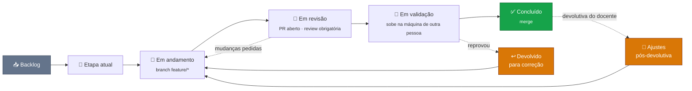

# 📋 Abrigo Já — Como o board funciona

### Colunas, campos, limite de trabalho em aberto e o que conta como "pronto".

👥 <strong>4</strong> pessoas &nbsp;•&nbsp; 📦 <strong>1</strong> repositório &nbsp;•&nbsp; 🗂️ o card diz <strong>a pasta</strong>, não o repo &nbsp;•&nbsp; 🎯 <strong>4</strong> etapas avaliadas

---

## 🎯 Em uma tela

Um board só, um repositório só. O que muda de card para card não é *onde o código mora* — é
**qual pasta** ele toca. Por isso o campo que no Só+1 era `Repositório` aqui é `Pasta`.

Toda tarefa começa como issue, vira branch, volta como PR e só fecha quando o merge acontece.
Nada de trabalhar em algo que não está no board: se não está lá, o time não sabe que existe — e,
nesta disciplina, o que não está registrado não conta para a nota de quem fez.

---

## 🗂️ Colunas

| Coluna | O que significa |
|---|---|
| **📥 Backlog** | Existe, mas ninguém prometeu quando |
| **🎯 Etapa atual** | Combinado para a etapa em curso, ainda não começou |
| **🔨 Em andamento** | Alguém está com a mão nisso agora (máx. 2 por pessoa) |
| **👀 Em revisão** | PR aberto, esperando o review de outro integrante |
| **🧪 Em validação** | Aprovado no código, rodando no `docker compose` local de outra pessoa |
| **↩️ Devolvido para correção** | Reprovou na validação e voltou. O que reprovou fica escrito na issue |
| **✅ Concluído** | Mergeado |
| **📝 Ajustes pós-devolutiva** | Já apresentado, mas o docente apontou correção |

> **Por que existe uma coluna só para a devolutiva.** `docs/descricao-trabalho-pratico.md:15` —
> "As etapas são cumulativas: o que foi entregue na etapa anterior continua sendo avaliado nas
> seguintes, **inclusive quanto a correções apontadas na devolutiva**". O que o professor apontar
> na Parte 2 continua valendo nota na Parte 4. Card de devolutiva misturado no backlog vira
> dívida invisível — e ela volta a ser cobrada em dezembro.
>
> As duas colunas de volta (`Devolvido` e `Ajustes pós-devolutiva`) contam para o **limite de
> WIP**: card devolvido é trabalho em aberto, não item novo. E ele volta para quem o entregou,
> não para quem achou o problema.

---

## 🏷️ Campos

| Campo | Para quê |
|---|---|
| **Pasta** | Onde o trabalho acontece — ver a tabela abaixo. **Obrigatório.** |
| **Área** | Domínio · Integração · Borda · Cliente · Infra · LLM · Documentação — *que competência a tarefa exige* |
| **Etapa** | `P1` · `P2` · `P3` · `P4` — a entrega a que o card pertence |
| **Entrega** | Data em que o card precisa estar pronto. Ver a ressalva abaixo — nas Partes 2 e 4 **não** é a data da apresentação |
| **Item da rubrica** | O critério avaliado que este card atende (ex.: `P2 · SAGA 20%`) |
| **Estimativa** | `P` (até meio dia) · `M` (1–2 dias) · `G` (3+ dias) · `GG` (quebra em tarefas menores) |
| **Prioridade** | Alta · Média · Baixa |
| **Responsável** | Uma pessoa. Trabalho em par: a segunda entra como `Co-authored-by:` no commit |

> **A `Entrega` das Partes 2 e 4 é a data do congelamento, não a da apresentação.** O repositório
> congela às 23h59 da véspera do primeiro dia — 21/10 e 09/12 — e commit posterior não é
> considerado naquela etapa (`docs/descricao-trabalho-pratico.md:56`). Preencher o campo com o dia
> da apresentação dá ao grupo um a seis dias de folga que não existem.
>
> | Etapa | `Entrega` correta | Apresentação |
> |---|---|---|
> | `P1` | 17/09/2026 | 17/09/2026 |
> | `P2` | **21/10/2026** | 22/10 ou 27/10 |
> | `P3` | 17/11/2026 | 17/11/2026 |
> | `P4` | **09/12/2026** | 10/12 ou 15/12 |
>
> E como a review é bloqueante, o último PR de uma etapa precisa **abrir** antes disso, não ser
> mesclado em cima da hora.

> Item marcado como **GG** não entra na etapa. Ele é quebrado no planejamento — se não dá para
> quebrar, é porque ainda não foi entendido.

### O campo `Pasta`

| Opção | O que é |
|---|---|
| `services/familias` | Cadastro e fila de priorização |
| `services/abrigos` | Vagas e estrutura |
| `services/suprimentos` | Estoque de kits |
| `services/logistica` | Veículos e ordens de transporte |
| `platform/acolhimento-saga` | Orquestração da transação (se a saga for orquestrada — ADR-0002) |
| `platform/assistente` | RAG, LangChain e resiliência do LLM |
| `gateway/` | Roteamento e responsabilidades de borda |
| `bff/` | `bff-painel` e `bff-campo` |
| `clients/` | `painel-web` e `app-campo` |
| `infra/` | Compose, Kubernetes, volumes e redes |
| `docs/` | Arquitetura, contratos, diagramas, ADRs, roteiros de apresentação |
| `.github/` + raiz | Processo: template de PR, CI, `docker-compose.yml`, `.env.example` |

**A `Pasta` é a primeira coisa que você bate o olho no card.** Ela responde *que tipo de
trabalho é esse*, e não só onde o arquivo vai parar. `docs/` não é "escrever texto": é o
entregável inteiro das Partes 1 e 2, que valem 30% da nota. Card de diagrama de sequência da
saga vai para `docs/`, mesmo que quem escreva seja quem implementou o orquestrador.

> **Card que toca mais de uma pasta é card mal quebrado — com uma exceção.** Mudança de contrato
> entre serviços vira **dois ou mais cards**: um em `docs/api/` fechando o contrato, e um por
> serviço que o implementa. É o contrato que sincroniza o trabalho, não o card. A exceção é a
> saga: ela atravessa serviços por natureza, e o card dela mora em `platform/acolhimento-saga`
> (ou em `docs/` enquanto for só modelagem).

---

## 🌊 Fluxo de uma tarefa

1. **Pegue a issue** — mova para `Em andamento` e se atribua.
2. **Crie a branch** conforme [`CONTRIBUTING.md`](../CONTRIBUTING.md), nomeada `feature/descricao-curta` ou `fix/descricao-curta`.
3. **Commite em português**, no padrão do `CONTRIBUTING.md`. Trabalhou em par? `Co-authored-by:` na mensagem — sem isso, só um dos dois recebe crédito (`docs/descricao-trabalho-pratico.md:43`).
4. **Abra o PR** referenciando a issue com `Closes #123` na mensagem do commit.
5. **Peça review a outro integrante e espere.**
6. **Merge** depois da aprovação.
7. **Mova o card para `Concluído`** — é na mão; o Projects não faz isso sozinho.

> ### ⚠️ Aqui a review **bloqueia** o merge — ao contrário do Só+1
>
> No Só+1 a regra era "ninguém respondeu, mergeie o seu próprio PR". **Aqui não.**
> `docs/descricao-trabalho-pratico.md:45` — "Cada PR deve ter ao menos um code review aprovado
> por outro integrante do grupo. **PRs auto-aprovados ou mesclados sem revisão não contam.**"
>
> Não contam para *nenhum dos dois*: nem para quem escreveu, nem para o review que não houve. Um
> PR mesclado sozinho é trabalho feito que desaparece da avaliação. Se ninguém revisou, o card
> fica em `Em revisão` — não avança.
>
> Consequência prática no ritmo: **revisar é tarefa, não favor.** Vale colocar no board. Quem
> abre PR na véspera do congelamento e ninguém revisa a tempo perde a entrega inteira daquele
> card.

> **Limite de WIP: 2 itens por pessoa em andamento.** Terceiro item só depois de fechar um.

---

## 📥 Definition of Ready — a issue pode entrar na etapa?

- [ ] Tem **critérios de aceite** verificáveis (dá para responder sim/não se está atendido)
- [ ] Está com **Pasta**, **Área** e **Estimativa** definidas
- [ ] Tem o **item da rubrica** que ela atende — card que não atende nenhum critério é trabalho que não vale nota; se for necessário mesmo assim, que seja uma decisão consciente
- [ ] Não depende de nada que ainda não existe — ou a dependência está linkada no board
- [ ] Se mexe em contrato entre serviços: o card de `docs/api/` já está fechado

## 📤 Definition of Done — a tarefa acabou?

- [ ] Critérios de aceite atendidos
- [ ] **Review aprovada por outro integrante** — sem isso o card não move
- [ ] Sobe no `docker compose` de outra pessoa, não só na sua (a partir da Parte 3)
- [ ] Documentação em `/docs` atualizada, se o comportamento ou a decisão mudou
- [ ] Decisão arquitetural nova virou **ADR** — a justificativa frente à alternativa é o que responde à arguição
- [ ] Nenhuma credencial no diff — credencial em código-fonte **zera** o item de Secrets na Parte 3

---

## 📅 Etapas e congelamento

O board não tem sprints de duas semanas: tem quatro entregas com data marcada.

| Etapa | Apresentação | Congelamento | Peso |
|---|---|---|---|
| `P1` Concepção e pitch | 17/09/2026 | — | 10% |
| `P2` Arquitetura | 22/10 e 27/10 | **21/10, 23h59** | 20% |
| `P3` Containers e Kubernetes | 17/11/2026 | — | 20% |
| `P4` Sistema funcionando | 10/12 e 15/12 | **09/12, 23h59** | 20% |

> **O congelamento é a data real da entrega**, não a apresentação. Commit posterior não é
> considerado naquela etapa (`docs/descricao-trabalho-pratico.md:56`). Como a review é
> obrigatória e bloqueante, o último PR de uma etapa precisa estar **aberto** com folga para
> alguém revisar — na prática, um ou dois dias antes do congelamento, não na véspera.

---

## 👥 Áreas e quem responde

Regra: **cada pessoa responde por pelo menos duas áreas**, e **cada área tem pelo menos duas
pessoas**. Com 4 pessoas e 7 áreas, cada um cobre três ou quatro. Não é cerca — qualquer um pega
qualquer card. A tabela diz *quem corre atrás quando ninguém pegou* e *a quem pedir review*.

| Área | Responsabilidade | Pastas típicas | Quem responde |
|---|---|---|---|
| ⚙️ **Domínio** | Regras de negócio dos 4 serviços | `services/{familias,abrigos,suprimentos,logistica}` | *(a definir)* |
| 🔗 **Integração** | Saga, eventos, outbox, CQRS | `platform/acolhimento-saga` · `docs/` | *(a definir)* |
| 🚪 **Borda** | Gateway e BFFs | `gateway/` · `bff/` | *(a definir)* |
| 💻 **Cliente** | Painel web e app de campo | `clients/` | *(a definir)* |
| 🐳 **Infra** | Docker, Compose, Kubernetes | `infra/` · raiz | *(a definir)* |
| 🤖 **LLM** | RAG, LangChain, resiliência, custo | `platform/assistente` | *(a definir)* |
| 📄 **Documentação** | Arquitetura, contratos, diagramas, ADRs, roteiros | `docs/` | *(a definir)* |

> **Documentação não é a sobra do trabalho de ninguém.** As Partes 1 e 2 são 30% da nota e são
> quase inteiramente `docs/`. Área de Documentação com uma pessoa só, ou sem ninguém porque "todo
> mundo escreve um pouco", é o jeito mais comum de perder nota tendo o sistema funcionando.

**Uma pessoa por card, mas o crédito é individual.** A nota de cada etapa é atribuída
individualmente, e o docente verifica "commits de autoria própria, participação em pull requests
e revisões realizadas, considerando volume, **distribuição temporal** e relevância técnica"
(`docs/descricao-trabalho-pratico.md:46` e §7.1). Um board com todos os cards de uma área no
nome da mesma pessoa é um retrato fiel — e caro para os outros três.

---

  Estrutura de pastas: <a href="../ESTRUTURA.md">ESTRUTURA.md</a> &nbsp;·&nbsp; Fluxo de Git e commits: <a href="../CONTRIBUTING.md">CONTRIBUTING.md</a>

